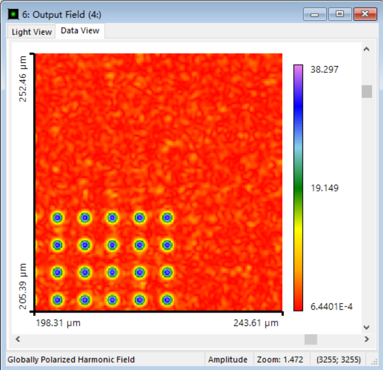
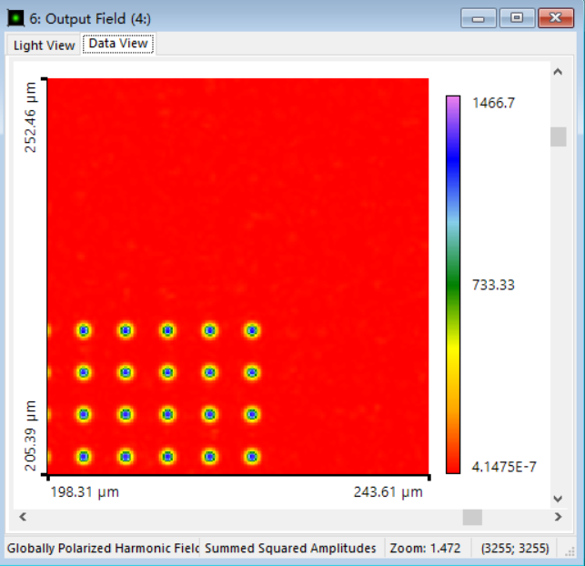
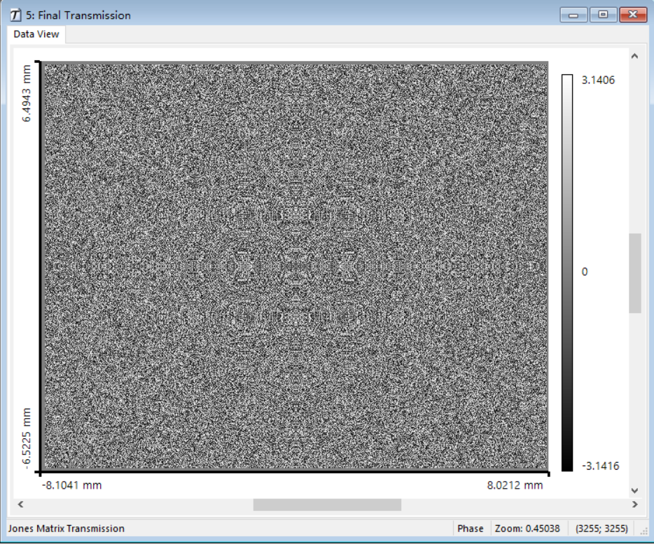
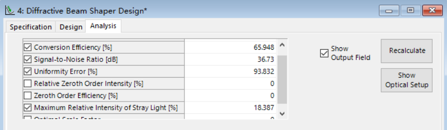
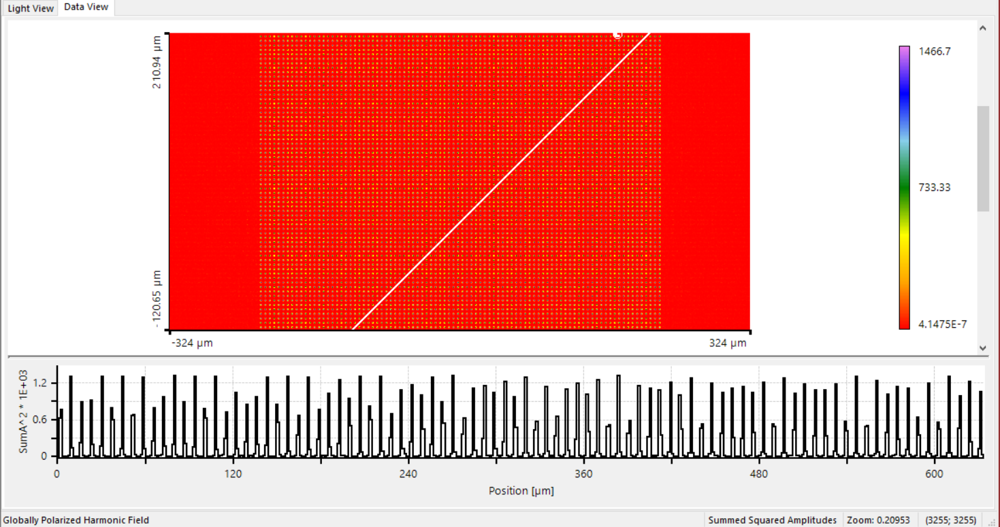

# 90

### Paramenters

- x linear polarized
- lambda: 810nm

### Results

             
图1 E_x
 

             
图2 sumA_sq
 

             
图3 transmissionPhase
 

             
图4 evaluation
 

             
图4 marker
 
