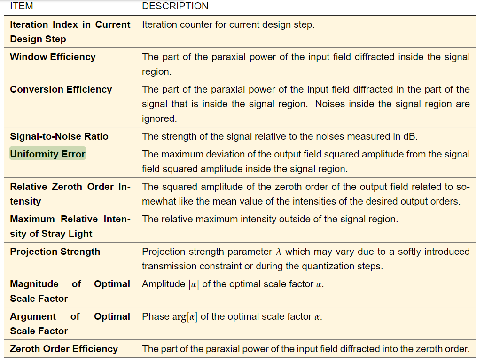
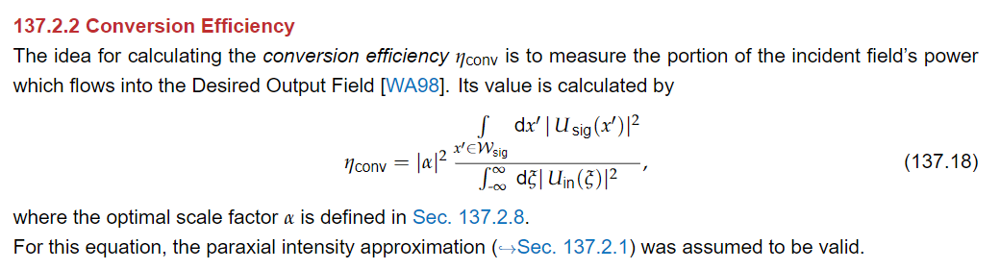
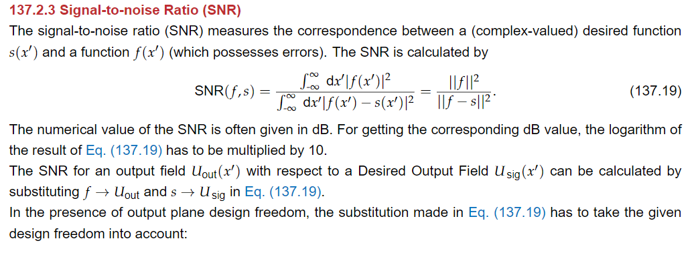
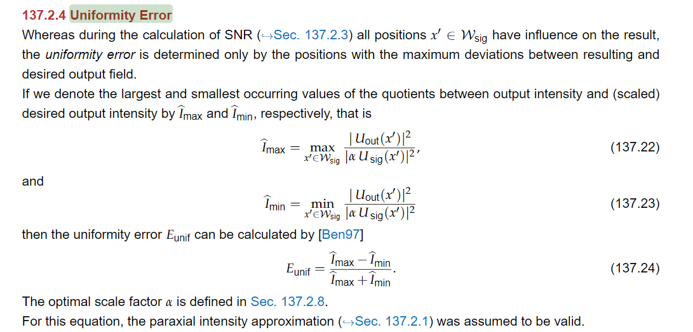
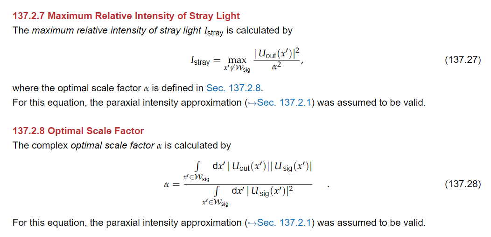
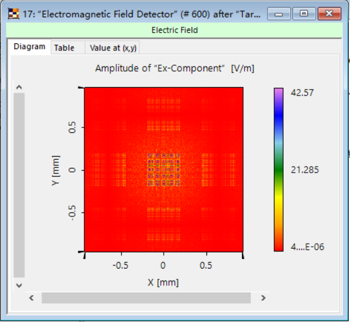
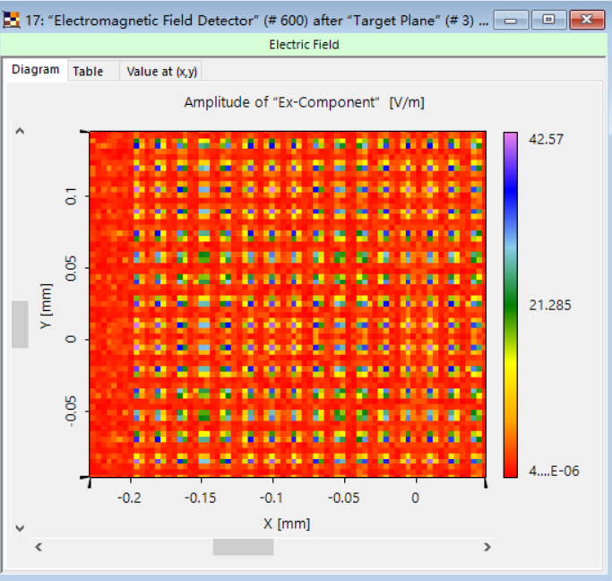
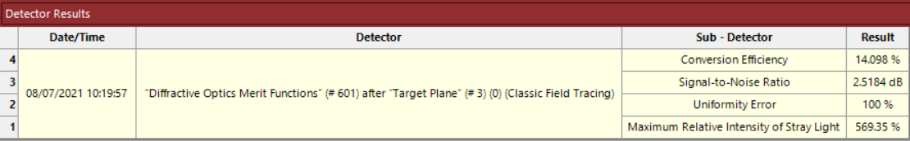

# SLM Simulation

### Explainations

             
图1 evaluationExplain1
 

             
图2 conversionEfficiencyExplain
 

             
图3 SNRExplain
 

             
图4 uniformityErrorExplain
 

             
图5 maximumRelativeIntensityExplain
 

### Results

- [50X50,785nm](test2/record.md)
- [60X60](60/record.md)
- [70X70](70/record.md)
- [90X90](90/record.md)

### Analysis

如图6-8是80X80 Classic Field Tracing 结果，其中图6中可以看到比较明显的次级衍射阵列（$\sinc$）,图7可以看到当前设定下（Pixelation Factor:3X3）精度不是太够，导致图8中结果差别较大，但是提升Pixelation Factor后内存不太够用，暂时还没有跑。

             
图6 analysisResults1
 

             
图7 analysisResults2
 

             
图8 analysisResults3
 

