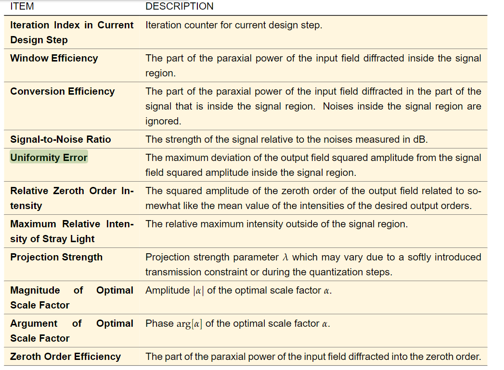
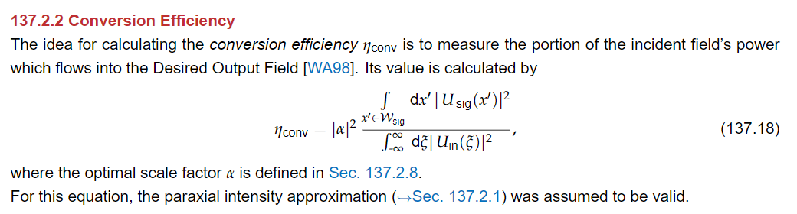
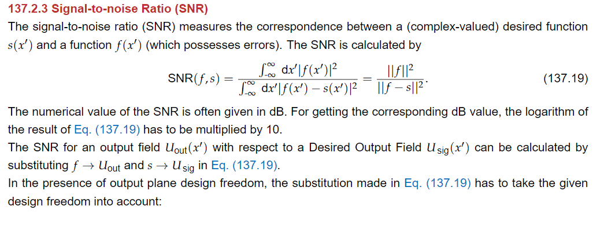
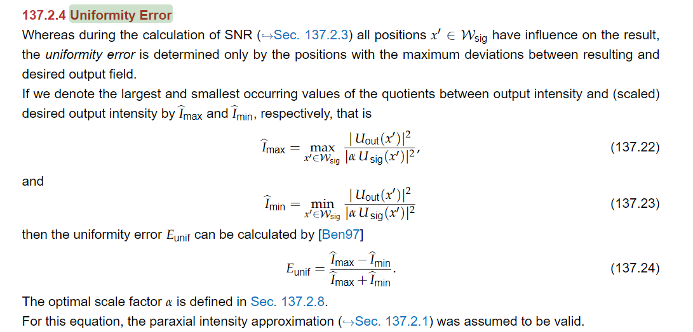

# SLM Simulation

### Explainations

             
图1 evaluationExplain1
 

             
图1 conversionEfficiencyExplain
 

             
图1 SNRExplain
 

             
图1 uniformityErrorExplain
 

             
图1 maximumRelativeIntensityExplain
 

### results

- [50X50,785nm](test2/record.md)
- [60X60](60/record.md)
- [70X70](70/record.md)
- [90X90](90/record.md)